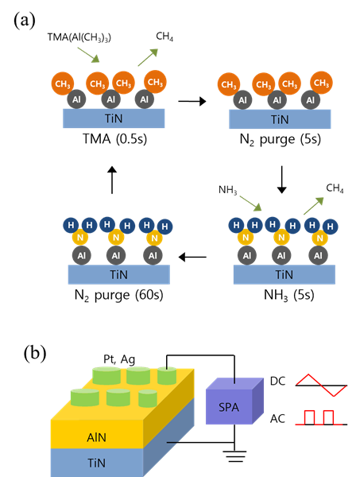
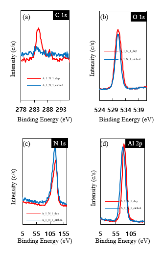
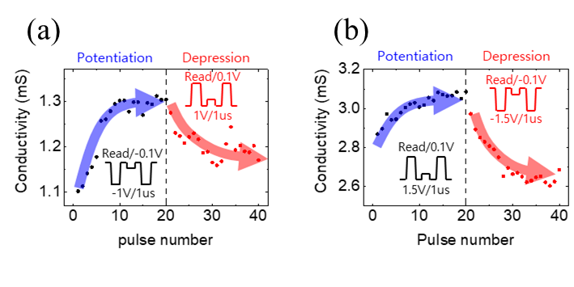

# 캡스톤 연구: 질화물 멤리스터의 전극 물질 차이에 의한 뉴로모픽 시냅스 특성 비교

## 연구 개요
- **소속:** 서울과학기술대학교 신소재공학과
- **주제:** AlN 기반 멤리스터 소자에서 상부 전극 물질(Ag vs Pt)에 따른 뉴로모픽 시냅스 특성 비교
- **결과:** 대학생 프로젝트 경진대회 우수상

## 연구 배경
- AI 연산(알파고)은 약 300kW 소비 vs 인간 뇌는 약 20W
- 폰 노이만 구조의 한계 → 뉴로모픽 컴퓨팅으로 해결 시도
- 멤리스터: 이전 이력에 따라 저항이 변하는 소자 → 시냅스 모방 가능

## 소자 구조
```
Ag 또는 Pt (상부 전극, ~50nm)
AlN 박막 (절연층, 10nm 또는 14nm)
TiN (하부 전극, 100nm)
```

**TiN을 하부 전극으로 고정한 이유**
- 화학적으로 안정적(불활성) → 실험 중 반응 안 함
- 상부 전극(Ag vs Pt) 차이만 보려면 나머지 변수는 모두 고정해야 함
- 비교 실험의 기본 원칙: 보고 싶은 변수 하나 빼고 나머지 다 고정

## ALD 공정 다이어그램 및 소자 구조



## ALD 공정 조건
- 전구체: TMA (trimethylaluminum) → Al(CH₃)₃, 상온 액체, 가열하면 기체
- 반응 가스: NH₃
- 증착 온도: 340°C
- 1 cycle: TMA(0.5s) → N₂ purge(5s) → NH₃(5s) → N₂ purge(60s)
- 총 cycle: 65 cycle (→ 10nm), 100 cycle (→ 14nm)
- GPC: 약 0.16~0.21 nm/cycle
- 최적 균일도: 50 cycle에서 non-uniformity 7.35%

**ALD를 선택한 이유**
Pt vs Ag 전극 비교 실험에서 AlN 두께를 고정해야 했다.
ALD는 원자층 단위로 정밀 제어가 가능해서 이 목적에 맞았다.

**한 사이클 메커니즘**
1. TMA 흘림 → Al이 표면에 붙고 CH₃가 매달려 있는 상태
2. N₂ purge → 떠다니는 TMA 제거 (표면에 붙은 Al-CH₃는 그대로)
3. NH₃ 흘림 → H가 CH₃랑 결합 → CH₄로 빠져나감 → Al-N 결합 완성
4. N₂ purge → 남은 NH₃ 제거
→ 자기제한 반응: 한 번에 딱 한 층만 쌓임

**두께 측정: Ellipsometer**
- 빛을 박막에 비스듬하게 쏘면 표면/내부 두 군데서 반사
- 두 반사파의 위상 차이로 두께 역산
- 웨이퍼 5개 지점(top/left/center/right/bottom) 측정 후 평균 → 균일도 확인
- 비파괴 분석, nm 단위 정밀 측정 가능

## XPS 분석 결과



- 분석 목적: AlN 박막 화학적 조성 및 결합 상태 확인
- 에칭 전/후 비교 분석 수행
- Al-N 결합: 74eV 부근에서 확인
- Al-O 결합: 75~76eV 부근에서 확인
- AlN 박막이 잘 형성됨을 검증

**에칭 전/후 비교 이유**
표면은 공기 중 산소에 노출되면 자연산화막(Al-O)이 생긴다.
에칭으로 표면을 살짝 깎아낸 뒤 측정해야 내부 AlN의 진짜 결합 상태를 볼 수 있다.

**왜 Al-N(74eV)과 Al-O(75~76eV) 피크가 다르냐**
O는 N보다 전자를 잡아당기는 힘이 강하다(전기음성도 높음).
Al-O 결합에서는 Al 전자가 더 꽉 묶여있어서 떼어내려면 더 높은 에너지가 필요하다.
이걸 Chemical Shift(화학적 이동)라고 한다.

## 전기적 특성 비교 (Ag vs Pt 전극)

**SPA(반도체 파라미터 분석기)로 측정**
- DC: 전압 바꿔가며 I-V 곡선 측정 → 기본 전기 특성 확인
- AC(펄스): 짧은 전압 펄스 반복 인가 → LTP/LTD 시냅스 특성 측정

| 항목 | AAT (Ag/AlN/TiN) | PAT (Pt/AlN/TiN) |
|------|------------------|------------------|
| 전극 종류 | 활성 전극 | 불활성 전극 |
| 저항 수준 | 상대적으로 높음 | 상대적으로 낮음 |
| Switching | Self-compliance switching | Negative bias에서 EF 발생 |

## 시냅스 특성 (LTP/LTD)



- **LTP (Long-Term Potentiation, 장기 강화)**: 자극 반복 → 연결 강해짐 → 저항 낮아짐
- **LTD (Long-Term Depression, 장기 억압)**: 반대 자극 → 연결 약해짐 → 저항 높아짐

**왜 DC 아닌 펄스(AC)를 쓰냐**
DC는 전압을 계속 걸어두면 저항이 한 번에 확 바뀐다.
시냅스처럼 점진적으로 변하는 걸 보려면 짧은 펄스를 여러 번 줘야 한다.

**AAT 소자 (Ag 전극) - ECM 메커니즘**
- LTP: 음전압 인가 → Ag → Ag⁺ 이온화 → AlN 통과해 아래로 이동 → 필라멘트 형성 → 저항 낮아짐
- LTD: 양전압 인가 → 필라멘트 Ag⁺ 이온화 → 위로 이동 → 필라멘트 끊김 → 저항 높아짐
- 펄스마다 필라멘트가 조금씩 자라거나 끊겨서 점진적 변화 발생

**PAT 소자 (Pt 전극)**
- Pt는 불활성 → 이온 이동 없음
- LTP: 양전압 인가 / LTD: 음전압 인가 (AAT와 반대 방향)
- 정확한 메커니즘은 아직 연구 중 (산소 공공 이동 또는 결함 트랩 유력)

**측정 조건**
- 연속 전압 펄스 20회 인가 (1μs 폭)
- AAT: potentiation -1V / depression +1V
- PAT: potentiation +1.5V / depression -1.5V
- 두 소자 모두 점진적 다단계 저항 변화 확인

## 배운 것
- ALD 공정 조건이 박막 품질에 미치는 영향 직접 확인
- XPS Chemical Shift로 결합 상태 판별하는 원리 이해
- 전극 물질(활성/불활성)에 따라 switching 메커니즘이 달라짐
- 비교 실험에서 변수 고정의 중요성 (두께, 하부 전극 고정)
- 공정 변수와 전기적 특성 간의 상관관계 해석
